<div align="center">


<br />


</div>

---

## 👋 Bem-vindos(as)

Esta organização guarda os projetos da **Trilha de Formação em Desenvolvimento de Soluções com IA** da Projetar Soluções.

Cada pessoa constrói **a sua própria aplicação**, do primeiro `print()` até um sistema que conversa com um modelo de inteligência artificial. O projeto não é entregue no fim: ele **nasce na semana 1 e cresce toda semana**, e cada etapa fica registrada em um repositório aqui.

> Quem chega nesta página vê o caminho que vocês percorreram. Por isso o repositório importa tanto quanto o código.

---

## 🗺️ O caminho, semana a semana

```mermaid
flowchart LR
    S1["<b>1</b><br/>Primeiros passos<br/>em Python"] --> S2["<b>2</b><br/>Lógica, decisões<br/>e repetições"]
    S2 --> S3["<b>3</b><br/>Organizando<br/>dados e código"]
    S3 --> S4["<b>4</b><br/>Git, GitHub e<br/>primeiros dados"]
    S4 --> S5["<b>5</b><br/>Estatística e<br/>Machine Learning"]
    S5 --> S6["<b>6</b><br/>API e banco<br/>de dados"]
    S6 --> S7["<b>7</b><br/>IA generativa<br/>aplicada"]
    S7 --> S8["<b>8</b><br/>Testes e<br/>apresentação"]

    classDef base  fill:#084e8c,stroke:#a9d8f5,stroke-width:1px,color:#ffffff
    classDef meio  fill:#0b6bb8,stroke:#a9d8f5,stroke-width:1px,color:#ffffff
    classDef fim   fill:#ecfbf4,stroke:#0b7a55,stroke-width:1px,color:#1b2a3d
    class S1,S2 base
    class S3,S4,S5,S6 meio
    class S7,S8 fim
```



| Semana | Tema | O que passa a existir no seu projeto |
|:---:|---|---|
| **1** | Primeiros passos em Python | O programa roda e faz alguma coisa |
| **2** | Lógica, decisões e repetições | Ele decide e repete — deixa de ser uma linha reta |
| **3** | Organizando dados e código | Deixa de ser um arquivo só; ganha estrutura |
| **4** | Git/GitHub e primeiros dados | Passa a ter histórico, versão e dados de verdade |
| **5** | Estatística e Machine Learning | Aprende com os dados em vez de só reagir |
| **6** | API e banco de dados | Ganha memória e passa a ser acessível de fora |
| **7** | IA generativa aplicada | Passa a conversar, interpretar e gerar |
| **8** | Testes, ajustes e apresentação | Vira produto: testado, documentado, apresentável |

---

## ⏰ Como é o dia

<table>
<tr><th align="left">Manhã</th><th align="left">Tarde</th></tr>
<tr valign="top"><td>

| Horário | Bloco |
|---|---|
| 07h – 08h | Estudo orientado |
| 08h – 09h | Encontro guiado |
| 09h – 11h | **Laboratório** |

</td><td>

| Horário | Bloco |
|---|---|
| 13h – 14h | Encontro guiado |
| 14h – 15h30 | Estudo orientado |
| 15h30 – 17h | **Laboratório** |

</td></tr>
</table>

**Encontro guiado** é o momento com a equipe de mediação, onde o conteúdo do dia é apresentado. **Estudo orientado** é o tempo para os materiais indicados. **Laboratório** é onde o seu projeto anda.

> ### 📝 A última meia hora é do README
> Todo dia termina com o registro do que foi feito. Na sexta, esse registro é apresentado junto com o GitHub. Documentar não é a tarefa do fim — é parte do trabalho.

---

## 📦 Onde fica cada coisa

| Repositório | Para que serve |
|---|---|
| [`modelo-trilha`](https://github.com/Projetar-Solucoes/modelo-trilha) | O ponto de partida do seu repositório (use o botão **Use this template**) |
| [`materiais-trilha`](https://github.com/Projetar-Solucoes/materiais-trilha) | Bases de dados e guias das aulas |
| `trilha-seunome` | O **seu** projeto — um por estagiário, crescendo semana a semana |

As aulas, os vídeos, os exercícios e a correção automática ficam na **Plataforma Projetar**, no menu **Trilha**.

### 🔁 Manhã faz, tarde revisa — e vice-versa

A partir da semana 4, todo pull request é revisado por alguém **da outra turma**: quem é da manhã abre o PR e alguém da tarde revisa no mesmo dia; quem é da tarde abre o PR e alguém da manhã revisa no dia seguinte. É assim que funcionam as equipes que trabalham em lugares e horários diferentes.

---

## 🎒 As regras do jogo

<table>
<tr>
<td width="50%" valign="top">

### ✅ O que se espera

- Projeto **individual**, com apoio constante da equipe de mediação
- Toda semana termina com uma **entrega prática**, documentada no repositório
- Commits pequenos e frequentes, com mensagens que expliquem o **porquê**
- README sempre refletindo o estado atual do projeto

</td>
<td width="50%" valign="top">

### 🤖 Sobre usar IA

O uso de inteligência artificial como apoio é **permitido e incentivado** — com uma condição, que vale para tudo o que entrar no seu projeto:

> **Você precisa conseguir explicar, testar e modificar o que foi gerado.**

Código que você não sabe defender não é seu. Use a IA para aprender mais rápido, não para pular a parte de entender.

</td>
</tr>
</table>

---

## 🧰 O que você vai encostar a mão

<div align="center">

[](https://skillicons.dev)

</div>

---

## 🚀 Subindo o seu projeto aqui

<details>
<summary><b>Passo a passo — do repositório vazio ao primeiro envio</b></summary>

<br />

**1. Crie o seu repositório a partir do modelo**

Abra o [modelo-trilha](https://github.com/Projetar-Solucoes/modelo-trilha) e clique em **Use this template → Create a new repository**. Em **Owner**, escolha `Projetar-Solucoes` (e não o seu usuário pessoal). Nome: `trilha-seunome`. Deixe **Public**.

O modelo já vem com o README guiado, o `.gitignore` certo, uma pasta para cada semana e o [guia rápido do Git](https://github.com/Projetar-Solucoes/modelo-trilha/blob/main/COMO-USAR-O-GIT.md).

Depois, na Plataforma Projetar, abra **Trilha → Meu GitHub** e informe o seu usuário e o nome do repositório: é assim que as atividades são conferidas.

**2. Traga o repositório para o seu computador**

```bash
git clone https://github.com/Projetar-Solucoes/trilha-seunome.git
cd trilha-seunome
```

**3. Trabalhe em um branch, não direto na `main`**

```bash
git checkout -b semana-01
```

**4. Salve seu trabalho**

```bash
git add .
git commit -m "semana 1: primeiro programa que lê e responde"
git push -u origin semana-01
```

**5. Abra um Pull Request**

O GitHub vai oferecer o botão **Compare & pull request**. Descreva o que você fez e o que aprendeu — é isso que a equipe de mediação vai ler.

</details>

<details>
<summary><b>O que um bom README de projeto tem</b></summary>

<br />

- **O que o projeto faz** — em duas frases, sem jargão
- **Como rodar** — os comandos exatos, do zero, na ordem
- **O que já funciona e o que não** — honestidade vale mais que promessa
- **O que você aprendeu na semana** — o registro que você faz todo dia
- **Imagens ou GIF** mostrando o programa rodando

Se alguém de fora consegue rodar o seu projeto só lendo o README, ele está bom.

</details>

---

<div align="center">

### 💚 Boa trilha!

Dúvida sobre conteúdo, projeto ou Git: fale com a equipe de mediação.


</div>
